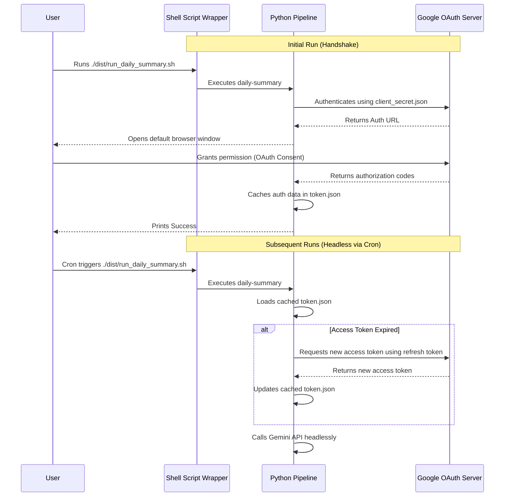

# Google Cloud OAuth 2.0 Desktop Flow Guide

This guide explains how to set up the Google Cloud OAuth 2.0 Desktop Application authentication flow. This mechanism enables our automated script to securely access the Gemini API (via the `google-genai` SDK) headlessly on your machine using a cached refresh token (`token.json`).

---

## Why This Flow?
*   **No Public Endpoint Required**: Unlike server flows, a desktop flow doesn't require a public server domain or redirect URL.
*   **Headless-Friendly**: The interactive login browser is only required **once** during the initial setup. Subsequent runs use a refresh token to silently authorize the script indefinitely.
*   **No Billing Required**: Free GCP developer projects are fully supported (you do not need a paid Google Cloud Billing account).

---

## Step-by-Step Setup Instructions

### Step 1: Create a Google Cloud Project
1. Open the [Google Cloud Console](https://console.cloud.google.com/).
2. Click the project dropdown in the top navigation bar and select **New Project**.
3. Name your project (e.g., `Daily Tech Articles Summarizer`) and click **Create**.

### Step 2: Enable the Generative Language API
1. In the console, search for **Generative Language API** in the top search bar.
2. Select it and click **Enable**. (This API hosts the Gemini models).

### Step 3: Configure the OAuth Consent Screen
Because this is a custom application, you must declare who can log in:
1. Navigate to **APIs & Services > OAuth consent screen** using the left sidebar.
2. Select User Type: **External** and click **Create**.
3. Fill out the required basic information:
   *   **App name**: e.g., `daily-articles-summarizer`
   *   **User support email**: Your email address
   *   **Developer contact information**: Your email address
4. Click **Save and Continue** through Scopes (no need to add explicit scopes here, the script requests them dynamically).
5. On the **Test Users** screen, click **Add Users** and enter your Google account email address.
   > [!IMPORTANT]
   > While the app is in "Testing" mode, only the email addresses explicitly added as test users here will be allowed to log in.
6. Save and complete the configuration.

### Step 4: Generate Client Credentials
1. Navigate to **APIs & Services > Credentials**.
2. Click **+ Create Credentials** at the top and select **OAuth client ID**.
3. Select Application type: **Desktop app**.
4. Name the client (e.g., `daily-summary-cli`) and click **Create**.
5. Find your new OAuth Client ID in the list, click the **Download JSON** button on the far right.
6. Rename the downloaded file to **`client_secret.json`** and save it in your project root:
   `/Users/mattswart/Source/Python/ai-automata/client_secret.json`

---

## Handshake & Headless Operation



### Initial Manual Run (One-time Handshake)
When you first execute the script:
1. Run:
   ```bash
   ./dist/run_daily_summary.sh
   ```
2. The script detects that no `token.json` exists, prints an authorization link, and automatically opens your default web browser.
3. Log in with your Google Account (the one added as a Test User in Step 3).
4. Google will show a warning: *"Google hasn't verified this app"*.
   *   Click **Advanced**.
   *   Click **Go to daily-articles-summarizer (unsafe)**.
5. Grant permissions to access your Gemini API models.
6. Once completed, your browser will display *"The authentication flow has completed. You may close this window."*
7. The script will save your active login credentials (including the refresh token) into `token.json`.

### Headless Cron Execution
For subsequent executions, the Python pipeline loads the cached `token.json` file. If the access token has expired (typically after 1 hour), the Python library silently contacts Google's authentication servers using the cached **refresh token** to get a new access token. 

This happens entirely in the background, without requiring a browser or user interaction.
